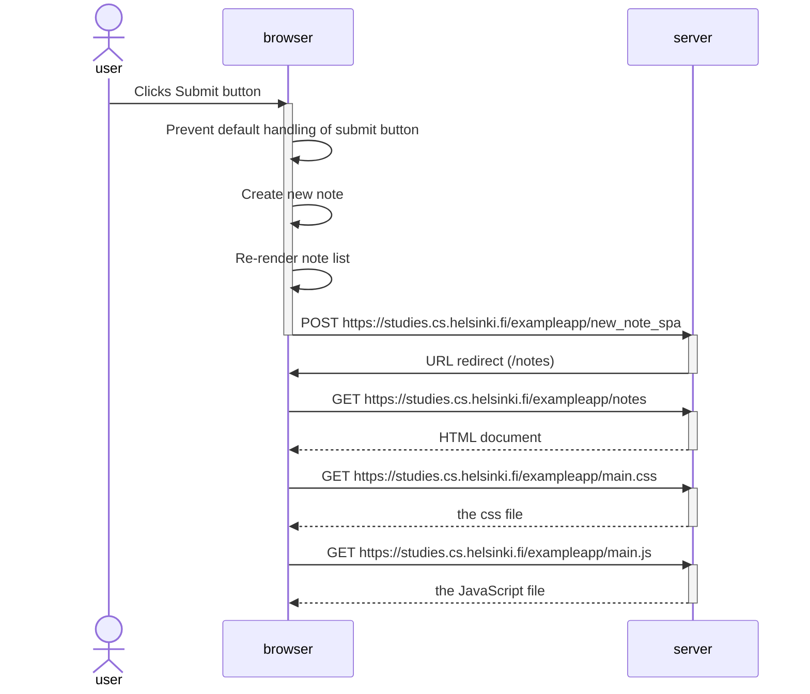

```mermaid
sequenceDiagram
    actor user
    participant browser
    participant server

    user->>browser: Clicks Submit button
    activate browser
    browser->>browser: Prevent default handling of submit button
    browser->>browser: Create new note
    browser->>browser: Re-render note list
    browser->>server: POST https://studies.cs.helsinki.fi/exampleapp/new_note_spa
    deactivate browser
    activate server
    server->>browser: URL redirect (/notes)
    deactivate server

    browser->>server: GET https://studies.cs.helsinki.fi/exampleapp/notes
    activate server
    server-->>browser: HTML document
    deactivate server

    browser->>server: GET https://studies.cs.helsinki.fi/exampleapp/main.css
    activate server
    server-->>browser: the css file
    deactivate server

    browser->>server: GET https://studies.cs.helsinki.fi/exampleapp/main.js
    activate server
    server-->>browser: the JavaScript file
    deactivate server
```
